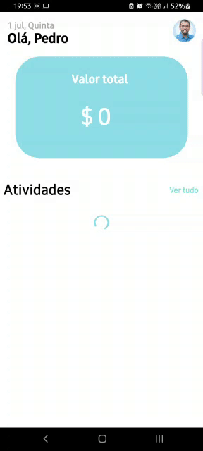

<h1 align="center">
	
</h1>

<h3 align="center">
  Oficina 2.0
</h3>

<p align="center">
Documentação do projeto Oficina 2.0 realizado no teste técnico de avaliação da codificar.

</p>

<p align="center">
  <a href="">
    
  </a>

  <a href="">
    
  </a>

  <a href="">
    
  </a>
</p>

<p align="center">
  <a href="#-about-the-project">Sobre o projeto</a>&nbsp;&nbsp;&nbsp;|&nbsp;&nbsp;&nbsp;
  <a href="#-technologies">Tecnologias</a>&nbsp;&nbsp;&nbsp;|&nbsp;&nbsp;&nbsp;
  <a href="#-getting-started">Começando</a>&nbsp;&nbsp;&nbsp;|&nbsp;&nbsp;&nbsp;
  <a href="#-license">Licença</a>
</p>

## 👨🏻‍💻 Sobre o projeto

- <p>
    Esse é o projeto Mobile desenvolvido para a empresa fíctícia Oficina. A linguagem de programação utilizada foi o Javascript utilizando o React Native.
    O projeto foi desenvolvido para a plataforma Android e não foi testado em ambientes iOS.
</p>

## ✅ Tarefas
<p>

- [x] Criar um repositório no Github e compartilhar o link com a equipe da Codificar.
- [x] Utilizando preferencialmente a linguagem Javascript e o framework React, criar a tela acompanhamento de orçamentos.
- [x] Buscar da API Pública os [orçamentos](https://my-json-server.typicode.com/codificar/oficina/proposals)
- [x] Montar a tela de lista contendo os campos: Nome do cliente, Valor, Nome do Vendedor
- [x] Ao clicar em um orçamento abrir um modal contendo sua descrição


</p>

<h1 align="center">
    
</h1>

Para ver a **api**, clique aqui: [Oficina Rest API](https://github.com/pedrobbarbosa/oficina2.0)</br>
Para ver o cliente **web client**, clique aqui: [Oficina Frontend](https://github.com/pedrobbarbosa/oficina_frontend)

## 🚀 Tecnologias

Tecnologias que utilizei para desenvolver esse cliente mobile.

- [ReactJS](https://reactjs.org/)
- [React Native](https://reactnative.dev/)
- [Axios](https://github.com/axios/axios)
- [Eslint](https://eslint.org/)
- [Prettier](https://prettier.io/)
- [EditorConfig](https://editorconfig.org/)

## 💻 Começando

### Requisitos

**Clone o projeto e acesse oarquivo**

```bash
$ git clone https://github.com/EliasGcf/oficinaMobile.git && cd oficinaMobile
```

**Siga os passos a seguir**

```bash
# Instale as dependencias
$ yarn

# Tenha certeza que o arquivo 'src/services/api.ts' tem o endereço para seu fornecedor

# Se você for utilizar o android, execute o comando abaixo. Se lembre de estar com o emulador aberto ou o telefone físico conectado.
$ yarn android

# Se você vai executa o emulador ios, execute esse comando
$ yarn ios
```
## 📝 Licença


Esse projeto está utilizando a licença do MIT - veja o arquivo para mais detalhes [LICENSE](LICENSE)

---

Made with 💜 &nbsp;by Pedro Barbosa 👋 &nbsp